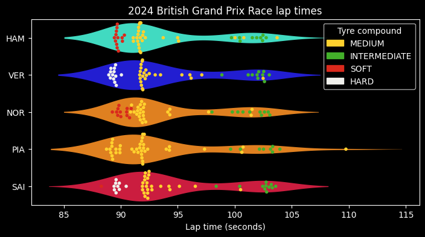
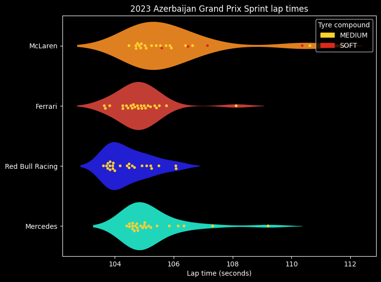

# F1 lap time violin plot functions

This repository contains two functions designed to visualise lap times in any Formula 1 session using data obtained from the FastF1 library.

## Functions

### `drivers_lap_violin(race, year=2025, session="R", drivers="top10")`

Plots a violin and swarm plot of lap times for drivers in the specified session.

- **Parameters:**
    - `race` (`str`): The race name or location identifier (e.g. `"Imola"`).
    - `year` (`int`): The session year. Default = `2025`
    - `session` (`str`): Session type (`"R"` for Race, `"Q"` for Qualifying, `"S"` for Sprint Race, `"SQ"` for Sprint Qualifying, `"FPx"` for Free Practice x). Default = `"R"`
    - `drivers` (`str` or list): Which drivers to include. Default = `"top10"`. Other options:
        - `"top5"`: Top 5 race finishers.
        - `"all"`: All drivers.
        - A list of three-letter driver codes (e.g. `["VER", "LEC", "NOR"]`).

- **Description:**
    - Creates a violin plot overlayed with a swarm plot of lap times for each of the selected drivers.
    - Colour-codes each lap by the tyre-compound used on that lap.
    - Lap 1, pit in/out laps, and laps not under a green flag are removed.

### `teams_lap_violin(race, year=2025, session="R", teams="all")`

Plots a violin and swarm plot of lap times for each team in the specified session.

- **Parameters:**
    - `race` (`str`): The race name or location identifier (e.g. `"Imola"`).
    - `year` (`int`): The session year. Default = `2025`
    - `session` (`str`): Session type (`"R"` for Race, `"Q"` for Qualifying, `"S"` for Sprint Race, `"SQ"` for Sprint Qualifying, `"FPx"` for Free Practice x). Default = `"R"`
    - `teams` (`str`): Which teams to include. Default = "`all`". Other options:
        - `"big4"`: Only include McLaren, Ferrari, Red Bull Racing, and Mercedes.
        - A custom list (e.g. `["Alpine", "Aston Martin", "Williams"]`)

## Dependencies

- Python 3.x
- pandas
- numpy
- matplotlib
- seaborn
- fastf1
- fastf1.plotting
- logging

## Example

```python
from lap_violin import drivers_lap_violin, teams_lap_violin

# Plot the lap times for the top 5 drivers from the 2024 British Grand Prix race
drivers_lap_violin("Britain", year=2024, session="R", drivers="top5")
```


```python
# Plot the lap times for the 'big 4' teams from the 2023 Azerbaijan Grand Prix Sprint Race
teams_lap_violin("Azerbaijan", year=2023, session="S", teams="big4")
```


## Acknowledgements:
This project realies heavily on the excellent [FastF1](https://theoehrly.github.io/Fast-F1/) library for accurate timing data.

## License

[MIT](https://choosealicense.com/licenses/mit/)